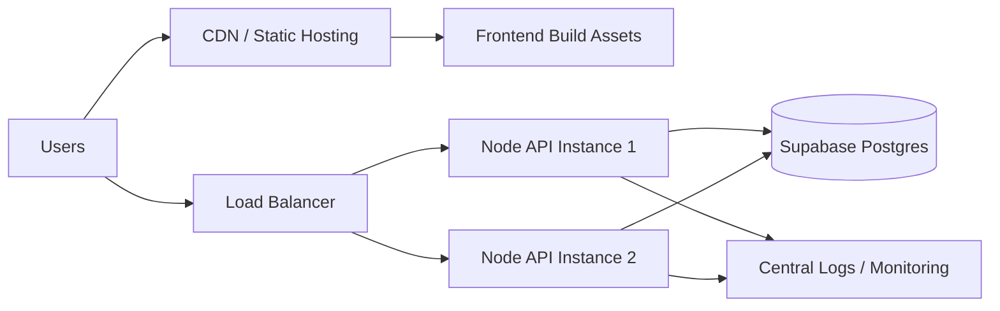
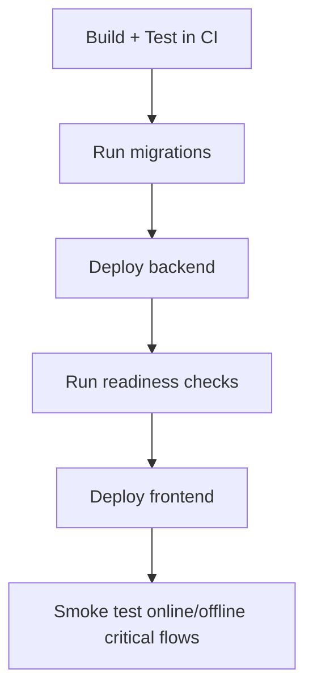

# Deployment and Infrastructure Guide

## 1) Recommended Production Topology

## 2) Hosting Recommendations

### Frontend

- Host static `client/dist` on reliable CDN-enabled platform.
- Ensure HTTPS and long-lived immutable caching for versioned assets.

### Backend

- Run Node API in at least 2 instances behind a load balancer.
- Run scheduler loops in a dedicated worker process (`npm run worker`) for cleaner separation from API request handling.
- Keep health endpoints wired:
  - `/api/live`
  - `/api/ready`
  - `/api/health`

### Database (Supabase)

- Use managed Postgres with SSL enabled.
- Tune app pool size to stay within Supabase connection limits.
- Maintain migration discipline with transactional SQL scripts.

## 3) Environment Variables

Minimum required:

- `NODE_ENV=production`
- `PORT`
- `JWT_SECRET` (>= 32 chars)
- `DATABASE_URL`
- `ALLOWED_ORIGINS`

Recommended optional hardening:

- `DB_MAX_POOL_SIZE`
- `DB_MIN_POOL_SIZE`
- `DB_CONNECTION_TIMEOUT_MS`
- `DB_STATEMENT_TIMEOUT_MS`
- `DB_IDLE_IN_TRANSACTION_TIMEOUT_MS`
- `DB_APPLICATION_NAME`
- `SSL_REJECT_UNAUTHORIZED=true`
- `SSL_CA_CERT` (if required by environment)

## 4) Deployment Flow

### Suggested Release Sequence

1. Backup DB and confirm rollback playbook.
2. Run migrations on production DB.
3. Deploy backend and wait for readiness.
4. Deploy frontend assets.
5. Run smoke checks (auth, orders, inventory, sync, archive).

## 5) Observability and SLO Basics

Track:

- API p95 latency by endpoint.
- Error rate by `code` and route.
- DB pool waiting count and connection errors.
- Offline replay success/conflict/needs_review volume.
- Archive scheduler and notification scheduler job outcomes.

## 6) Multi-instance Safety

- Keep scheduler advisory lock behavior enabled.
- Prefer `RUN_SCHEDULERS_IN_API=false` on API pods and run one or more worker pods with `npm run worker`.
- Verify only one instance runs each scheduled job cycle.
- Alert when lock-acquired runs fail repeatedly.

## 7) Rollback Strategy

- Application rollback: redeploy previous backend/frontend versions.
- Migration rollback: only if migration has explicit reverse plan.
- Emergency containment: disable risky feature flags/routes and preserve write integrity.

## 8) Production Go-Live Checklist

- [ ] SSL and CORS correctly configured
- [ ] secrets configured securely
- [ ] migrations applied and verified
- [ ] tests/lint/build green
- [ ] backup and rollback tested
- [ ] monitoring and alerting active
- [ ] offline-critical user paths smoke-tested
