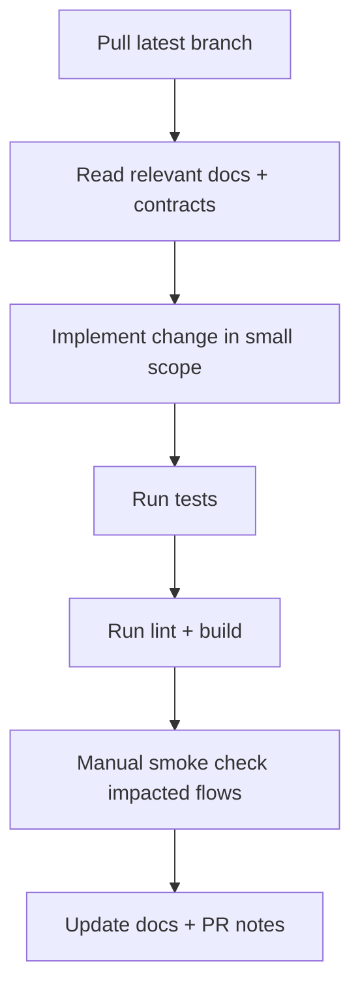

# Developer Workflow and Guardrails

## 1) Engineering Priorities

1. Preserve data integrity.
2. Preserve offline continuity.
3. Preserve deterministic API contracts.
4. Preserve operational traceability.

## 2) Daily Development Workflow



### Required Local Commands

- `npm test`
- `npm run lint`
- `npm run build`

## 3) Backend Change Rules

- Prefer `asyncHandler` + `AppError` for routes.
- Keep error payload envelope consistent:

```json
{
  "error": "...",
  "code": "...",
  "requestId": "..."
}
```

- Keep SQL parameterized (`$1`, `$2`, ...).
- Use `withTransaction` for multi-step writes.
- Clamp list limits and validate query filters.

## 4) Database Change Rules

- All schema updates via migration files.
- Avoid introducing runtime schema patching in request hot paths.
- Add indexes for new frequent `WHERE`, `JOIN`, and `ORDER BY` patterns.
- Validate migration rollback safety.

## 5) Frontend Change Rules

- Do not break offline queue persistence and replay semantics.
- Do not bypass cache fallback logic in manager/cashier critical pages.
- Keep Addis Ababa timezone display behavior intact for UI date rendering.

## 6) Route Addition Checklist

- Validation guards
- Auth and role authorization
- Location safety handling
- Error envelope consistency
- Idempotency behavior (for writes)
- Tests for success and conflict/error path

## 7) Pull Request Quality Bar

Each PR should include:

- change summary,
- risk/rollback notes,
- testing evidence,
- documentation updates if contracts or architecture changed.

## 8) Anti-Patterns to Avoid

- Ad-hoc route error responses.
- Non-transactional multi-table write flows.
- Directly mutating offline queue semantics without test coverage.
- Removing idempotency checks on retryable write endpoints.
