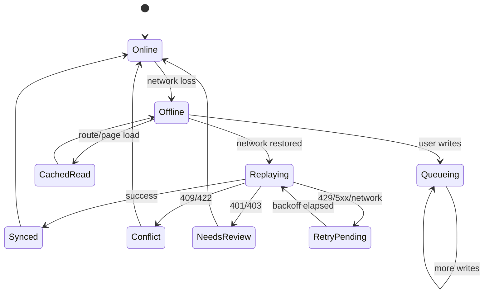
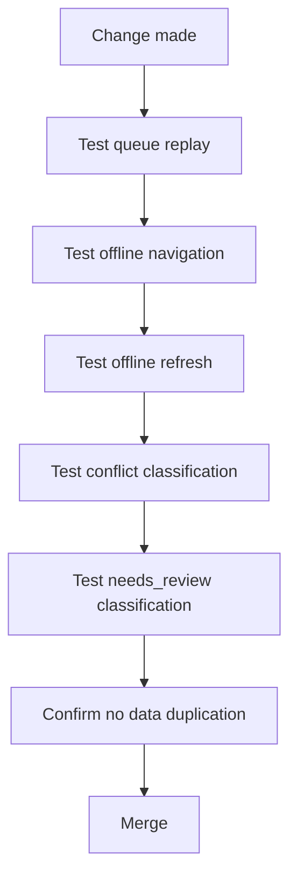

# Offline Refresh and Sync Protection Guide

This is the most critical maintenance guide in this repository.

If you change routing, caching, queue behavior, or service worker handling, follow this file before merging.

## 1) Critical Behavior Requirements

- Refreshing while offline must not force unexpected logout due to recoverable cache/network conditions.
- Navigating between pages while offline must preserve app shell behavior.
- Pending writes must remain durable and replay safely when network returns.
- Deterministic API failures must classify to stable queue statuses.

## 2) Runtime Model



## 3) Contract Dependencies

### Client depends on backend error contract

```json
{
  "error": "...",
  "code": "...",
  "requestId": "..."
}
```

### Queue semantics

- `409` / deterministic `4xx` -> `conflict`
- `401` / `403` -> `needs_review`
- `429` / `5xx` / network error -> retry pending with backoff

## 4) Do-Not-Break Rules

1. Do not remove idempotency key handling on write endpoints.
2. Do not remove fallback cache read path for orders/batches pages.
3. Do not change service worker production registration flow without validating offline refresh.
4. Do not add route redirects that assume online API bootstrap success.
5. Do not return inconsistent error JSON shapes in modified endpoints.

## 5) Pre-merge Validation for Offline-sensitive Changes



## 6) Quick Manual Test Script

1. Login and load orders/batches pages.
2. Disable network.
3. Refresh page and navigate between critical pages.
4. Create offline actions that queue writes.
5. Re-enable network.
6. Verify replay outcomes and no duplicated records.
7. Confirm UI state reconciliation and status badges.

## 7) Incident Recovery (If Offline Breaks)

- Revert latest route/cache/service-worker changes first.
- Confirm backend error envelope consistency.
- Confirm idempotency behavior in write routes.
- Re-run offline manual test script and queue replay tests.
