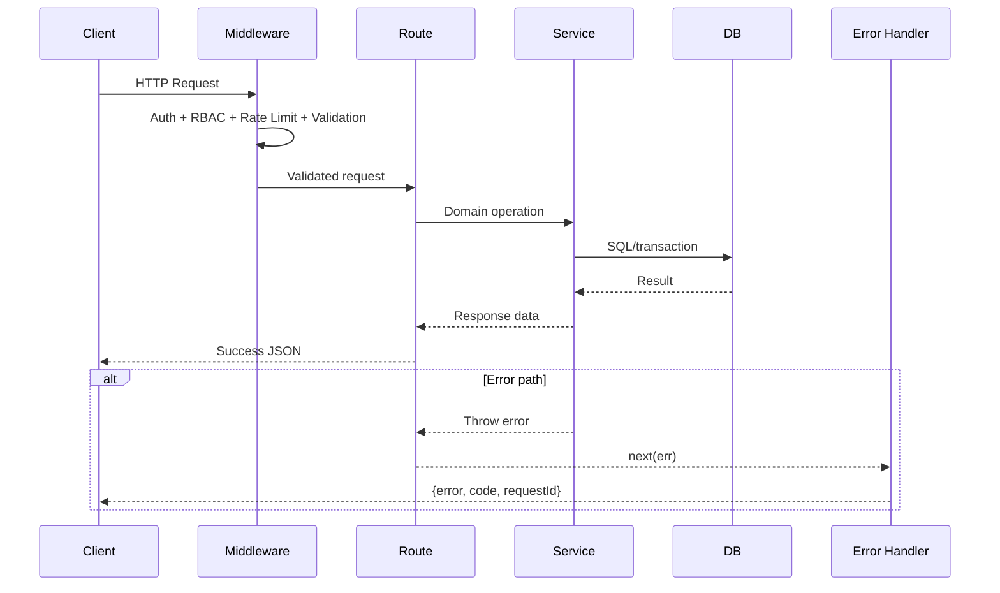
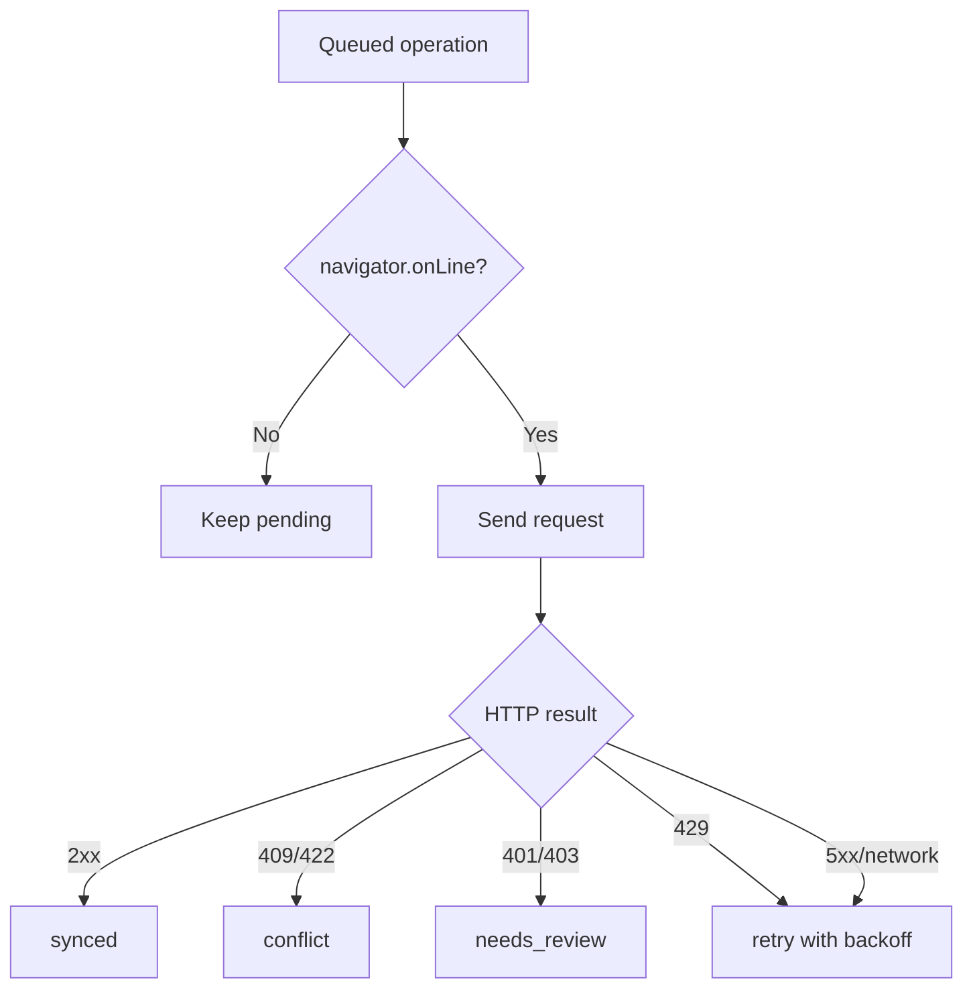
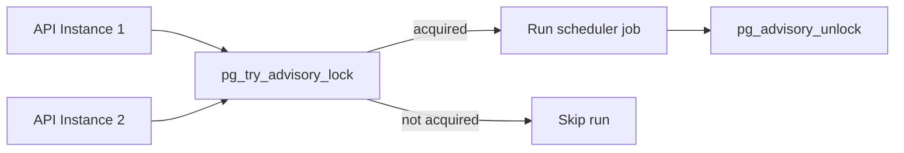
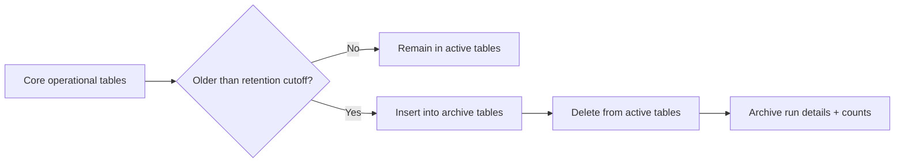
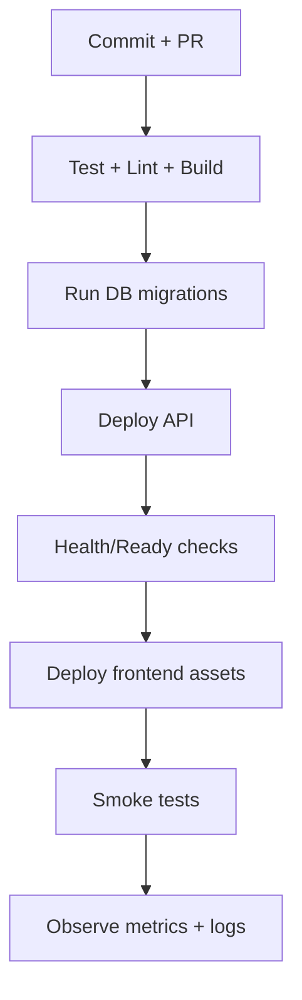

# System Diagrams

## End-to-End Request Lifecycle

```mermaid
sequenceDiagram
  participant C as Client
  participant M as Middleware
  participant R as Route
  participant S as Service
  participant D as DB
  participant E as Error Handler

  C->>M: HTTP Request
  M->>M: Auth + RBAC + Rate Limit + Validation
  M->>R: Validated request
  R->>S: Domain operation
  S->>D: SQL/transaction
  D-->>S: Result
  S-->>R: Response data
  R-->>C: Success JSON

  alt Error path
    S-->>R: Throw error
    R-->>E: next(err)
    E-->>C: {error, code, requestId}
  end
```

## Offline Queue Replay Logic

```mermaid
flowchart TD
  A[Queued operation] --> B{navigator.onLine?}
  B -- No --> C[Keep pending]
  B -- Yes --> D[Send request]
  D --> E{HTTP result}
  E -- 2xx --> F[synced]
  E -- 409/422 --> G[conflict]
  E -- 401/403 --> H[needs_review]
  E -- 429 --> I[retry with backoff]
  E -- 5xx/network --> I
```

## Scheduled Job Safety in Multi-instance Deployments

```mermaid
flowchart LR
  I1[API Instance 1] --> L[pg_try_advisory_lock]
  I2[API Instance 2] --> L
  L -->|acquired| J[Run scheduler job]
  L -->|not acquired| K[Skip run]
  J --> U[pg_advisory_unlock]
```

## Archive Data Lifecycle

```mermaid
flowchart LR
  Core[Core operational tables] --> Cutoff{Older than retention cutoff?}
  Cutoff -- No --> Keep[Remain in active tables]
  Cutoff -- Yes --> Move[Insert into archive tables]
  Move --> Delete[Delete from active tables]
  Delete --> Report[Archive run details + counts]
```

## Deployment Pipeline

```mermaid
flowchart TD
  Commit[Commit + PR] --> CI[Test + Lint + Build]
  CI --> Migrate[Run DB migrations]
  Migrate --> DeployAPI[Deploy API]
  DeployAPI --> Ready[Health/Ready checks]
  Ready --> DeployFE[Deploy frontend assets]
  DeployFE --> Smoke[Smoke tests]
  Smoke --> Monitor[Observe metrics + logs]
```
