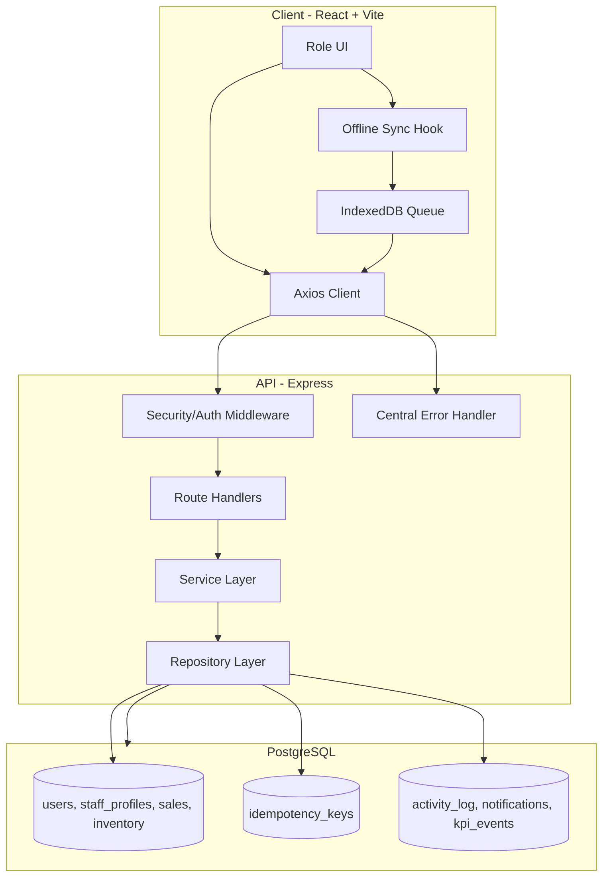
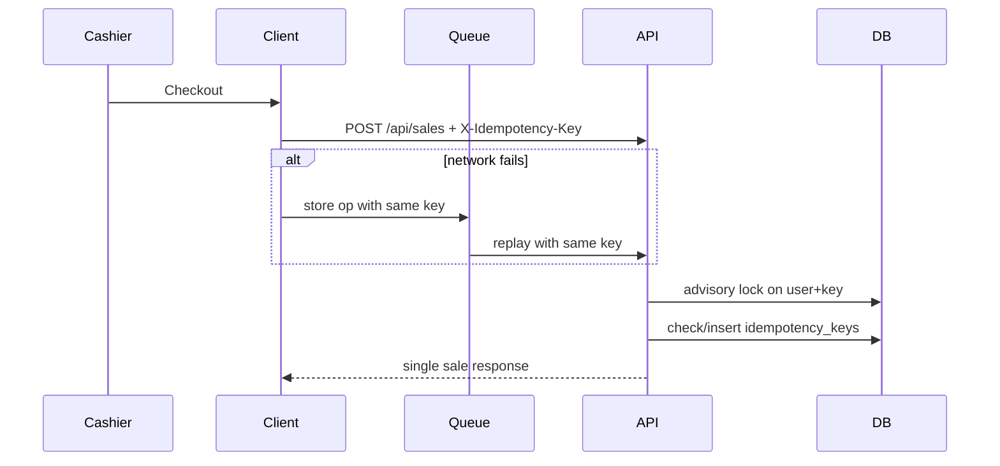

# Bakery Operations Web App

Role-based bakery operations platform with branch-aware workflows, offline-safe sales sync, and production security controls.

## System Architecture



## Offline and Idempotency Flow



## Backend Layering

- `server/routes/` handles HTTP transport + validation only.
- `server/services/` contains business lifecycle logic.
- `server/repositories/` owns SQL and transaction persistence.
- `server/middleware/` enforces auth/security/request context.
- `server/utils/errors.js` standardizes `{ error, code, requestId }` responses.

## Security Posture

- Helmet hardening, CORS allowlist, and rate limiting.
- JWT secret strength enforced at startup.
- Request correlation ID attached per request.
- SQL uses parameterized queries.
- Idempotency for retry-safe writes.

## Database and Migrations

Schema evolution should be handled by SQL migrations under `database/migrations/`.
Runtime route handlers do not perform schema migration tasks.

## Run

```bash
npm install
cd client && npm install && cd ..
npm run setup-db
npm run dev
```

## Quality Gates

```bash
npm test
npm run lint
npm run build
```

## Production Checklist

- Set `NODE_ENV=production`
- Set strong `JWT_SECRET` (32+ chars)
- Set `DATABASE_URL` with SSL policy
- Configure `ALLOWED_ORIGINS`
- Apply migrations before deploy
- Verify `/api/health`, `/api/ready`, `/api/live`
