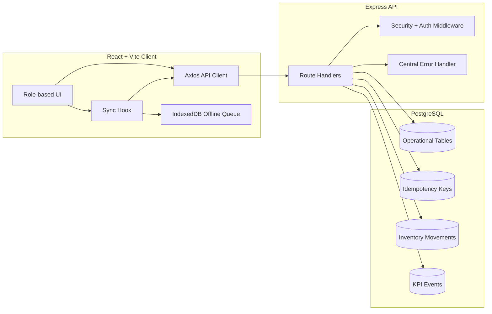
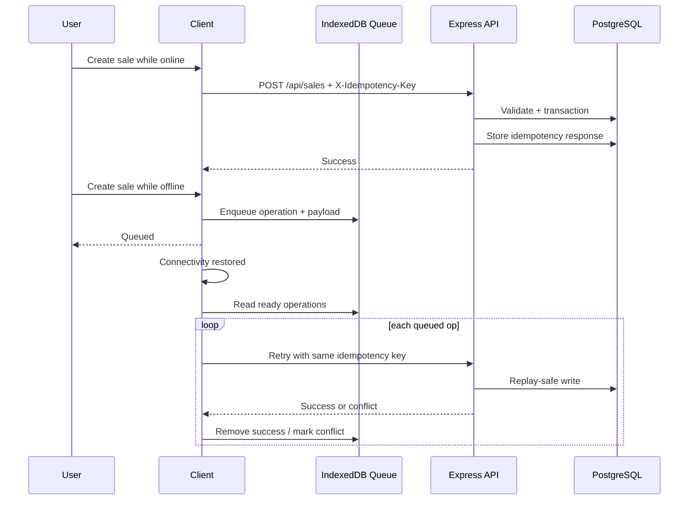

# Bakery Operations Web App

Production-focused, role-based bakery management platform with multi-branch operations, offline-safe writes, and inventory/sales/finance reporting.

## Core Capabilities

- Role-based access for admin, manager, cashier
- Branch-aware operations using `X-Location-Id`
- Idempotent writes for retry-safe operations using `X-Idempotency-Key`
- Offline queue with retry, conflict marking, and sync history
- Sales with inventory deduction, void flow, and movement ledger
- Expenses, staff payments, and branch reports
- Security middleware (Helmet, CORS policy, rate limiting, JWT)

## Architecture



## Offline Sync Flow



## Backend Structure

```text
server/
  index.js                    # app bootstrap, middleware, routes, lifecycle
  db.js                       # pool, query helper, transaction helper
  middleware/
    auth.js                   # JWT auth + role authorization
    security.js               # rate limiting, env validation, CORS
    requestContext.js         # requestId injection
  routes/                     # domain endpoints
  utils/
    errors.js                 # AppError classes, asyncHandler, central error handler
    location.js               # branch access resolver
```

## Frontend Structure

```text
client/src/
  api/axios.js                # API client + auth/location headers
  hooks/useOfflineSync.js     # sync loop + online/offline reaction
  utils/offlineQueue.js       # IndexedDB queue, retries, history, conflicts
  context/                    # auth, language, branch state
  pages/                      # role pages
  components/                 # shared UI
```

## Security Model

- JWT required for protected routes
- Password policy enforcement
- Per-environment rate limits
- CORS allow-list in production via `ALLOWED_ORIGINS`
- Helmet hardening and secure defaults
- Request ID on each API request (`X-Request-Id`) for traceability
- Consistent API errors with `{ error, code, requestId }`

## Environment Variables

See `.env.example`.

Required in production:

- `NODE_ENV=production`
- `JWT_SECRET` (32+ chars)
- `DATABASE_URL`
- `ALLOWED_ORIGINS`

Optional tuning:

- `DB_MAX_POOL_SIZE`, `DB_MIN_POOL_SIZE`
- `DB_CONNECTION_TIMEOUT_MS`, `DB_IDLE_TIMEOUT_MS`
- `SSL_REJECT_UNAUTHORIZED`, `SSL_CA_CERT`

## Run

```bash
npm install
cd client && npm install && cd ..
cp .env.example .env
npm run setup-db
npm run dev
```

## Quality Gates

```bash
npm test
npm run lint
npm run build
```

## Production Checklist

- Strong JWT secret configured
- Production CORS origins set
- Database SSL policy set
- Migrations applied
- Build succeeds
- Health/readiness probes return OK
- Logs monitored for sync conflicts, slow queries, and auth/rate-limit events
