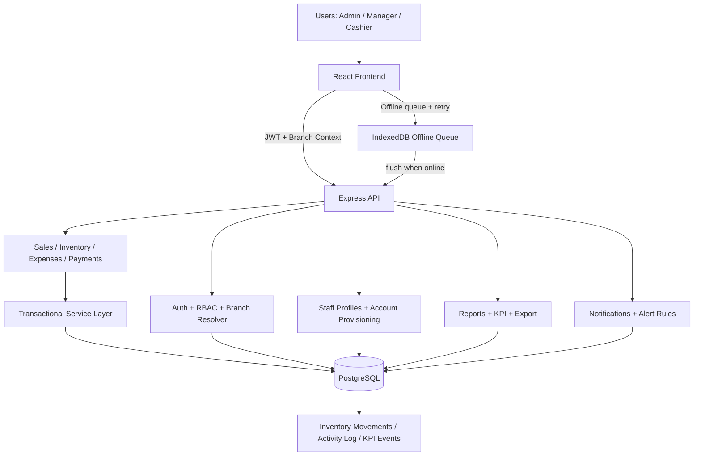

ASout3

> ⚠️ **NOTICE (Ready to push):** This branch is prepared for `main` push once your git remote is configured.

# Bakery Operations Web App

A role-based bakery management platform for day-to-day operations across one or many branches.

It includes:
- real-time inventory tracking,
- POS sales,
- expenses and staff payments,
- operational reports,
- branch-level controls,
- offline queue/retry logic,
- idempotent write handling,
- alert rules and KPI telemetry.

---

## 1) What this app solves

This project is designed for bakeries that need a **single operations system** across admin, manager, and cashier workflows.

### Core operational goals
- Prevent silent inventory drift and overselling.
- Keep sales/expense/batch writes reliable even on unstable internet.
- Give admins branch-level visibility and control.
- Provide simple, understandable screens for non-technical staff.

### Reliability goals
- Transaction-safe critical writes.
- Retry-safe writes through idempotency keys.
- Visible offline queue + retry/conflict history.
- Branch-aware access checks to avoid cross-branch leakage.

---

## 2) Feature overview

### 2.1 Role-based product experience
- **Admin**: full platform access, branch switching, reporting, staff/branch setup, notifications rules, sync monitor.
- **Manager**: product + inventory + batches + expenses at branch scope.
- **Cashier**: POS sales + sales history at branch scope.

### 2.2 Branch-aware operations
- Frontend stores selected branch context.
- Requests include branch context (`X-Location-Id` + query usage where needed).
- Backend validates branch access using `getTargetLocationId` + `user_locations` when available.

### 2.3 Inventory and batch flow
- Add/update inventory per product per branch.
- Send inventory batches atomically.
- Track ledger entries in `inventory_movements`.

### 2.4 Sales and oversell protection
- Sale creation validates stock before deducting quantity.
- If stock is insufficient, sale fails safely with clear error.
- Sale + sale-items + inventory deduction run transactionally.

### 2.5 Expenses and staff payments
- Expense create/update/delete and category summary.
- Staff payments with branch context and staff selection.

### 2.6 Reporting and export
- Daily/weekly/monthly summaries.
- Weekly CSV export.
- Branch summary and KPI summary endpoints.

### 2.7 Notifications and alerts
- Per-user notifications.
- Mark single/all as read.
- Admin alert rules for events (e.g., low stock/high sale).

### 2.8 Offline and retry resilience
- IndexedDB queue for critical write operations.
- Background sync hook.
- Retry/conflict history available in admin sync UI.
- Backend deduplication via `idempotency_keys`.

---

## 3) Tech stack

### Frontend
- React 18
- Vite
- React Router
- Axios
- Recharts
- Lucide React

### Backend
- Node.js + Express
- PostgreSQL (`pg`)
- JWT auth
- bcryptjs
- express-validator
- Morgan + CORS

---

## 4) Project structure

```txt
client/
  src/
    api/
    components/
    context/
    hooks/
    pages/
      admin/
      manager/
      cashier/
    utils/
server/
  middleware/
  routes/
  utils/
database/
  migrations/
  schema.sql
scripts/
```

---

## 5) Quick start (local PostgreSQL)

## 5.1 Prerequisites
- Node.js 18+ recommended
- PostgreSQL 12+
- npm

## 5.2 Install dependencies
```bash
npm install
cd client && npm install && cd ..
```

## 5.3 Create local env
```bash
cp .env.example .env
```

Set at minimum:
- `PORT=5000`
- `JWT_SECRET=...`
- either `DATABASE_URL=...` OR PG fallback vars (`PGHOST/PGPORT/PGUSER/PGPASSWORD/PGDATABASE`)

## 5.4 Initialize database
```bash
npm run setup-db
psql "$DATABASE_URL" -f database/migrations/001_ops_hardening.sql
psql "$DATABASE_URL" -f database/migrations/002_branch_access_and_kpi.sql
```

## 5.5 Start app
```bash
npm run dev
```

Access:
- Frontend: `http://localhost:3000`
- Backend: `http://localhost:5000`

Default seeded login:
- username: `admin`
- password: `admin123`

---

## 6) Supabase quick connect (recommended free hosted DB)

Use Supabase **Connection Pooler** URL (transaction mode, usually port `6543`) and include `sslmode=require`.

Example `.env` essentials:
```env
PORT=5000
NODE_ENV=development
JWT_SECRET=your_super_secret_jwt_key
DB_IP_FAMILY=4
DATABASE_URL=postgresql://postgres.<ref>:<password>@<region>.pooler.supabase.com:6543/postgres?sslmode=require
```

Then run:
```bash
npm run setup-db
psql "$DATABASE_URL" -f database/migrations/001_ops_hardening.sql
psql "$DATABASE_URL" -f database/migrations/002_branch_access_and_kpi.sql
npm run dev
```

Detailed guide: [`SUPABASE-SETUP.md`](./SUPABASE-SETUP.md).

---

## 7) Environment variables reference

### Server
- `PORT` — API port.
- `NODE_ENV` — `development` / `production`.
- `JWT_SECRET` — token signing secret.
- `DATABASE_URL` — preferred full DB connection string.
- `PGHOST`, `PGPORT`, `PGUSER`, `PGPASSWORD`, `PGDATABASE` — fallback PG config if `DATABASE_URL` is absent.
- `DB_IP_FAMILY` — set to `4` for IPv4-only environments.
- `DB_CONNECTION_TIMEOUT_MS` — DB connect timeout.
- `DB_IDLE_TIMEOUT_MS` — idle client timeout.

### Client
- `VITE_API_URL` — optional override for API base.

---

## 8) API overview

### Authentication
- `POST /api/auth/register`
- `POST /api/auth/login`
- `GET /api/auth/me`

### Locations / branches
- `GET /api/locations`
- `POST /api/locations` (admin)

### Admin management
- `GET /api/admin/users`
- `POST /api/admin/users`
- `PATCH /api/admin/users/:id/status`

### Products
- `GET /api/products`
- `GET /api/products/:id`
- `POST /api/products`
- `PUT /api/products/:id`
- `DELETE /api/products/:id`

### Inventory / batches
- `GET /api/inventory`
- `POST /api/inventory`
- `PUT /api/inventory/:productId`
- `DELETE /api/inventory/:id`
- `POST /api/inventory/batches`
- `GET /api/inventory/batches`
- `GET /api/inventory/batches/:id`

### Sales
- `POST /api/sales`
- `GET /api/sales`
- `GET /api/sales/:id`

### Expenses
- `GET /api/expenses`
- `POST /api/expenses`
- `PUT /api/expenses/:id`
- `DELETE /api/expenses/:id`
- `GET /api/expenses/summary/categories`

### Staff payments
- `GET /api/payments`
- `POST /api/payments`
- `PUT /api/payments/:id`
- `DELETE /api/payments/:id`
- `GET /api/payments/summary`

### Reports
- `GET /api/reports/daily`
- `GET /api/reports/weekly`
- `GET /api/reports/weekly/export`
- `GET /api/reports/monthly`
- `GET /api/reports/products/profitability`
- `GET /api/reports/branches/summary`
- `GET /api/reports/kpis`

### Notifications
- `GET /api/notifications`
- `GET /api/notifications/rules` (admin)
- `POST /api/notifications/rules` (admin)
- `PUT /api/notifications/rules/:id` (admin)
- `PUT /api/notifications/:id/read`
- `PUT /api/notifications/:id`
- `PUT /api/notifications/read-all`
- `PUT /api/notifications/mark-all-read`
- `GET /api/notifications/unread/count`
- `DELETE /api/notifications/:id`

### Activity
- `GET /api/activity`

---

## 9) Database schema highlights

Primary entities:
- `users`
- `locations`
- `products`, `categories`
- `inventory`, `inventory_batches`, `batch_items`
- `sales`, `sale_items`
- `expenses`, `staff_payments`
- `notifications`, `activity_log`

Reliability/observability entities:
- `idempotency_keys`
- `inventory_movements`
- `kpi_events`
- `alert_rules`
- `user_locations`

See full schema in `database/schema.sql` and changes in `database/migrations/`.

---

## 10) Reliability and data consistency model

### 10.1 Transactions
Critical write workflows run in DB transactions to guarantee all-or-nothing behavior.

### 10.2 Idempotency
For retry/offline scenarios, endpoints can use `x-idempotency-key` to avoid duplicate writes.

### 10.3 Inventory safety
Sales cannot reduce stock below zero. If insufficient stock exists, the sale fails with an explicit error.

### 10.4 Branch access enforcement
Branch target resolution validates access by role and mapping. Legacy admin behavior is preserved where no explicit branch assignments exist.

### 10.5 Offline queue
Client stores queued operations in IndexedDB and retries via background sync logic.

---

## 11) Troubleshooting

### 11.1 `ECONNREFUSED 127.0.0.1:5432`
Your API cannot reach local PostgreSQL.

Actions:
1. Verify `.env` DB settings.
2. Start Postgres locally (or use Supabase).
3. Re-run setup + migrations.
4. Restart `npm run dev`.

### 11.2 `ENETUNREACH ... supabase.co:5432`
Usually an IPv6/routing limitation in dev environment.

Actions:
1. Use Supabase Connection Pooler URL (`:6543`).
2. Ensure `sslmode=require` in `DATABASE_URL`.
3. Set `DB_IP_FAMILY=4`.
4. Restart app.

### 11.3 Branch 403 errors (`You do not have access to this branch`)
- Ensure selected branch is valid for logged-in user.
- For admins with explicit branch mappings, requested branch must be assigned.
- Check `user_locations` and `users.location_id` records.

### 11.4 Sales blocked with insufficient stock
This is expected data safety behavior.
- Refill inventory first (manual adjustment or batch flow), then retry sale.

---

## 12) Operational notes

- Use admin **Branches & Staff** page to create branches and cashier/manager accounts.
- Use admin **Sync Queue** page to inspect offline retries/conflicts.
- Use branch selector in the top bar for admin branch context.
- For reports/KPIs, verify selected branch context before validating totals.

---

## 13) Security and production guidance

Before production:
- Set strong `JWT_SECRET`.
- Restrict DB credentials and rotate periodically.
- Use HTTPS.
- Apply least-privilege branch/user assignments.
- Configure backups for DB.
- Add API rate limiting + centralized logging/monitoring.

---

## 14) Scripts

Root scripts:
- `npm run dev` — run backend + frontend concurrently.
- `npm run server` — backend only.
- `npm run client` — frontend only.
- `npm run build` — frontend production build.
- `npm run setup-db` — initialize DB schema and seed defaults.

---

## 15) Current status

- Multi-branch, offline queue, idempotency, KPI, and alert-rule foundations are implemented.
- Admin branch/staff setup screens are implemented.
- Major recent stability fixes include branch-access fallback handling and payments route location-resolution fixes.

If you want, next pass can include:
- end-to-end tests for critical write flows,
- stricter API error contracts,
- UI notification/toast system standardization across all screens,
- dashboard caching and report query performance tuning.

---

## 16) Architecture diagram (Mermaid)



### Offline sync behavior (production intent)
- Cashier can sell while offline using locally cached product catalog for selected branch.
- Writes are queued with idempotency keys in IndexedDB.
- Background sync retries automatically and moves hard 4xx failures to conflict log for admin review.
- Admin can trigger manual sync from **Sync Queue** page and inspect sync/failure history.
