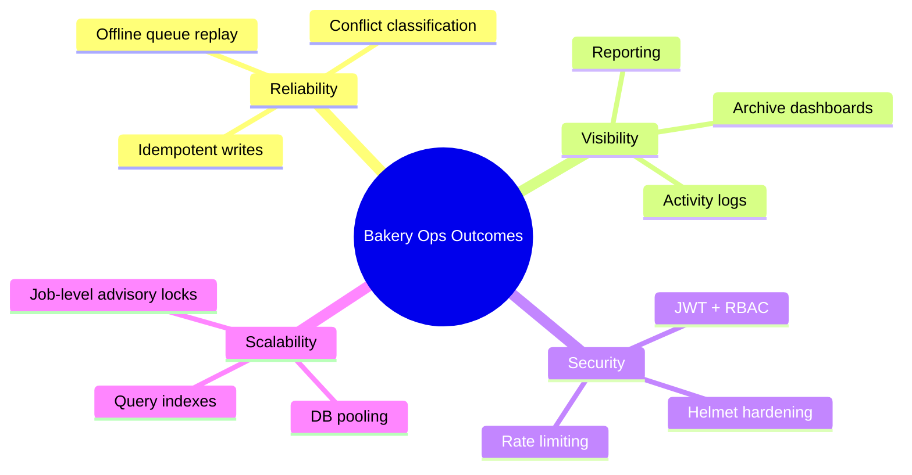
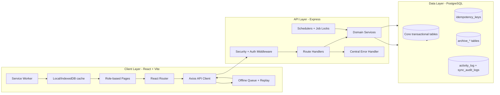
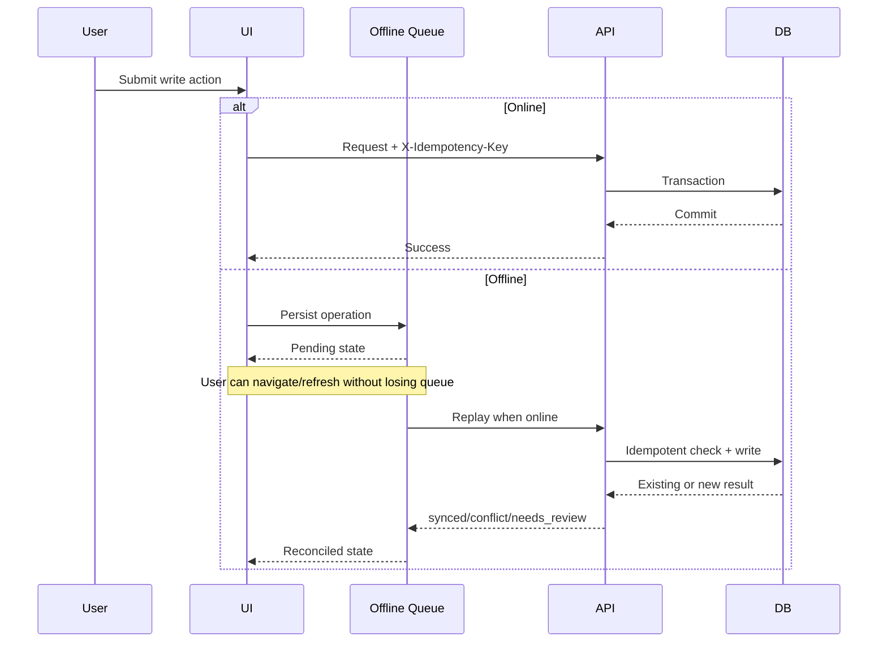
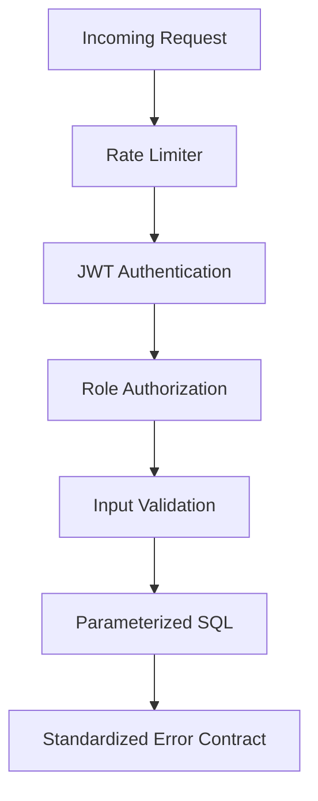
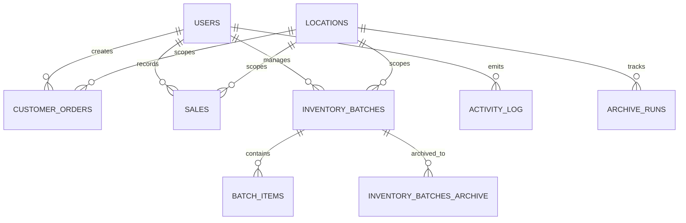

# Bakery Operations Platform

A production-oriented, offline-capable bakery management system for multi-branch operations, designed for reliable daily execution under unstable connectivity and strict operational accountability.

**Lead Developer:** Asotu3

---

## Table of Contents

- [Executive Summary](#executive-summary)
- [Platform Outcomes](#platform-outcomes)
- [System Architecture](#system-architecture)
- [Offline Sync and Offline Refresh Design](#offline-sync-and-offline-refresh-design)
- [Security and Compliance Controls](#security-and-compliance-controls)
- [Database Architecture](#database-architecture)
- [API Design and Contracts](#api-design-and-contracts)
- [Performance and Scalability](#performance-and-scalability)
- [Timezone Strategy](#timezone-strategy)
- [Repository Structure](#repository-structure)
- [Developer Workflow](#developer-workflow)
- [Testing Strategy](#testing-strategy)
- [Operations and Deployment](#operations-and-deployment)
- [Documentation Map](#documentation-map)
- [Production Readiness Checklist](#production-readiness-checklist)

---

## Executive Summary

The Bakery Operations Platform combines:

- **Role-based workflows** for admin, manager, and cashier responsibilities.
- **Offline-safe transaction handling** with idempotent replay semantics.
- **Inventory and batch lifecycle tracking** including archive workflows.
- **Auditable operational history** through logs, sync audit records, and traceable error contracts.

The system is intentionally engineered so day-to-day branch activity can continue through temporary internet or backend instability without corrupting sales/order data.

---

## Platform Outcomes



### Core Business Capabilities

- Sales, orders, expenses, payments, and inventory management.
- Branch-aware access via role and location constraints.
- Scheduled archive and due-order notification jobs.
- Addis Ababa timezone-consistent UI presentation.

---

## System Architecture



### Architecture Principles

1. Keep the API deterministic under retries.
2. Treat network volatility as a normal condition.
3. Preserve auditable event history for operations and finance.
4. Keep operational safety defaults in production.

---

## Offline Sync and Offline Refresh Design



### Reliability Mechanisms

- Idempotent write headers for retry-safe replay.
- Replay status model (`synced`, `failed`, `conflict`, `needs_review`, `ignored`, `resolved`).
- API error envelope consistency (`error`, `code`, `requestId`) for client classification.
- Cache fallback in key manager/cashier pages for continuity.
- Single-flight offline queue flush locking to prevent overlapping replay runs.
- Service-worker shell caching that discovers and caches current hashed build assets from `index.html`.
- Role-aware order status transition guards (cashier/manager/admin) to prevent invalid production-to-delivered jumps.
- Stronger order input validation for phone numbers and custom order detail lengths.

### Important Development Note

In development mode, service workers are intentionally unregistered to prevent stale production workers from interfering with Vite dev behavior. Validate offline refresh using production build/preview behavior (`npm run build` + `npm run preview` in `client/`).

---

## Security and Compliance Controls



### Security Controls in Place

- JWT secret length enforcement and issuer validation.
- Account lockout/backoff after repeated failed logins.
- Refresh-token rotation endpoint for stronger session lifecycle handling.
- Role-based access control on privileged routes.
- Rate limiting tiers (auth/general/strict).
- Helmet security headers and production-oriented CORS controls.
- Parameterized SQL queries to reduce injection risk.
- Password complexity validation.
- Request-scoped IDs for incident traceability.

### Security Roadmap Recommendations

- Extend structured security event logging for SIEM-friendly ingestion.
- Add automated refresh-token cleanup/retention jobs and suspicious-login alerting.
- Introduce tenant-aware session revocation controls for emergency lockout scenarios.

---

## Database Architecture



### Data Strategy

- Core transactional tables for operational workload.
- Archive tables for historical cold-storage movement.
- Sync audit and activity logs for diagnostics and accountability.
- Performance indexes added for high-frequency filters/sorts (inventory batches, sales, notifications, archive runs).

### Migration and Setup Safety

- Transactional migration execution.
- Advisory lock during setup/migrations to avoid concurrent runners.
- Optional dev-only seed path, gated by environment variables.
- Startup auth schema guard ensures lockout columns and refresh-token table exist in partially migrated environments.

---

## API Design and Contracts

### Global Error Contract

```json
{
  "error": "Human-readable error message",
  "code": "ERROR_CODE",
  "requestId": "req-..."
}
```

### Offline Write Header Contract

```http
Authorization: Bearer <token>
X-Location-Id: <branch-id>
X-Idempotency-Key: <stable-operation-id>
X-Queued-Request: true
X-Queued-Created-At: <iso-timestamp>
X-Retry-Count: <retry-number>
```

### High-Value API Domains

- `/api/auth` for authentication and account operations.
- `/api/orders` for customer order lifecycle.
- `/api/sales` for checkout and revenue records.
- `/api/inventory` for stock and batch operations.
- `/api/archive` for retention policy and archive execution.
- `/api/sync` for offline audit status and reconciliation metadata.

---

## Performance and Scalability


### Implemented Optimizations

- Connection pool tuning and timeout controls.
- Slow query/transaction warning logs.
- List endpoint limit clamping and input validation.
- New DB indexes for common read paths.
- Advisory locks for scheduled jobs in multi-instance environments.

---

## Timezone Strategy

- Backend stores and returns timestamps in server/UTC semantics.
- Frontend display is standardized to `Africa/Addis_Ababa` for locale rendering paths.
- This ensures users across pages see consistent business-time display.

---

## Repository Structure

```text
client/                    React + Vite frontend
server/                    Express API and backend logic
  middleware/              auth, security, request context
  routes/                  API endpoints
  services/                business workflows and schedulers
  utils/                   error helpers, location helpers, etc.
database/
  schema.sql               base schema
  migrations/              incremental SQL migrations
scripts/                   setup and utility scripts
docs/                      deep architecture and contract docs
Main docs/                 primary onboarding and operational guides
```

---

## Developer Workflow

1. Configure `.env` from `.env.example`.
2. Run database setup (`npm run setup-db`).
3. Start local environment (`npm run dev`).
4. Validate changes (`npm test`, `npm run lint`, `npm run build`).
5. Follow offline contract and error contract rules for new endpoints.

---

## Testing Strategy

- Unit tests for middleware and utility critical paths.
- Offline queue behavior tests for replay and failure semantics.
- Error handler tests for envelope consistency.
- Build/lint checks for integration-level confidence.

Recommended expansion:

- Add route-level integration tests for auth/orders/inventory/archive.
- Add API contract snapshot tests for error and pagination behavior.
- Add scheduled-job simulation tests for multi-instance scenarios.

---

## Operations and Deployment

See dedicated deployment guidance in:

- `Main docs/deployment-and-infrastructure.md`
- `docs/architecture-and-ops-playbook.md`

---

## Documentation Map

### Primary docs

- `README.md` (this file)
- `Main docs/README.md`
- `Main docs/developer-workflow-and-guardrails.md`
- `Main docs/deployment-and-infrastructure.md`
- `Main docs/offline-refresh-sync-protection.md`

### Technical references

- `docs/offline-contract.md`
- `docs/architecture-and-ops-playbook.md`

---

## Production Readiness Checklist

- [ ] `NODE_ENV=production`
- [ ] strong `JWT_SECRET` (32+ chars)
- [ ] `DATABASE_URL` configured with SSL
- [ ] `ALLOWED_ORIGINS` configured
- [ ] migrations applied successfully
- [ ] health/readiness probes validated
- [ ] offline contract verified in client replay flows
- [ ] build/test/lint green in CI
- [ ] scheduler locks validated in multi-instance deployment

---

For implementation details and contributor guardrails, continue in `Main docs/README.md`.
