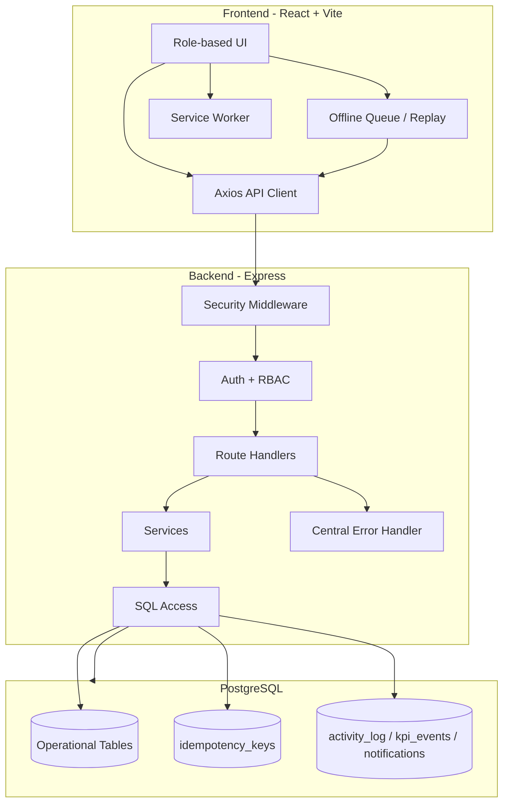

# Asout3

# Bakery Operations Platform

A production-ready, role-based bakery operations platform for multi-branch teams that need reliable daily sales, inventory, staffing, and financial transparency under real-world connectivity constraints.

---

## Table of Contents

- [1. Product Vision](#1-product-vision)
- [2. Key Capabilities](#2-key-capabilities)
- [3. Technology Stack](#3-technology-stack)
- [4. System Architecture](#4-system-architecture)
- [5. Reliability and Offline Design](#5-reliability-and-offline-design)
- [6. Security Model](#6-security-model)
- [7. Data and Financial Transparency Model](#7-data-and-financial-transparency-model)
- [8. API Conventions](#8-api-conventions)
- [9. Repository Structure](#9-repository-structure)
- [10. Environment Configuration](#10-environment-configuration)
- [11. Local Development Setup](#11-local-development-setup)
- [12. Build, Test, and Quality Workflow](#12-build-test-and-quality-workflow)
- [13. Dashboard and Reporting Guide](#13-dashboard-and-reporting-guide)
- [14. Deployment and Operations](#14-deployment-and-operations)
- [15. Incident and Recovery Playbook](#15-incident-and-recovery-playbook)
- [16. Troubleshooting](#16-troubleshooting)
- [17. Contribution Workflow](#17-contribution-workflow)
- [18. Production Readiness Checklist](#18-production-readiness-checklist)

---

## 1. Product Vision

Bakery Operations Platform is built for bakery owners, ground managers, and cashiers who need one operational system that is:

- **fast at checkout**,
- **resilient under unstable internet**,
- **safe against duplicate sales writes**,
- **transparent for owner-level financial reporting**,
- **scalable to many branches with role-specific controls**.

The platform prioritizes integrity of transactions and practical usability over ideal network assumptions.

---

## 2. Key Capabilities

### Role-Based Operations

- **Admin**: cross-branch visibility, staff/account management, financial reporting, KPI monitoring.
- **Manager**: branch inventory and batch workflow, operational oversight.
- **Cashier**: sales execution and transaction history.

### Branch-Aware Context

- Branch targeting through `X-Location-Id` for scoped operations.
- Owner views can aggregate branch snapshots while preserving branch-level traceability.

### Offline-First Safety

- Queue-backed write replay from client when connectivity drops.
- Idempotency key strategy to avoid duplicate persisted transactions.
- Controlled replay pacing to reduce outage retry storms.

### Financial Transparency

- Sales, expenses, staff payments, batch production cost, and net-profit composition.
- Daily/weekly/monthly reporting with detail tables and KPI summaries.

---

## 3. Technology Stack

### Frontend

- React 18
- Vite
- React Router
- Axios
- Recharts
- Lucide React

### Backend

- Node.js 18+
- Express.js
- PostgreSQL (`pg`)
- JWT auth
- bcryptjs

### Security and Validation

- Helmet
- express-rate-limit
- express-validator

---

## 4. System Architecture



Design goals:

- predictable behavior in high-throughput cashier flows,
- stable backend behavior during transient DB/network issues,
- auditable operational and financial records.

---

## 5. Reliability and Offline Design

### 5.1 Idempotent Writes

For offline-safe writes:

```http
X-Idempotency-Key: unique-key-<timestamp-or-uuid>
```

The backend protects against duplicate processing by reusing prior deterministic outcomes when the same idempotency key is replayed.

### 5.2 Offline Queue Replay

- Writes are stored client-side when network is unavailable.
- Replay uses the same idempotency identity.
- Flush overlap is guarded to prevent concurrent duplicate loops.

### 5.3 Backpressure and Retry Safety

- Batch-limited replay protects degraded servers.
- Retry-storm prevention pauses remaining operations after outage-style failures (`5xx`, `429`, transport errors).

### 5.4 Transaction Resilience

- Rollback-aware transaction handling.
- Transient DB classification and stable `503` responses for availability issues.
- Request IDs for cross-layer traceability.

---

## 6. Security Model

### Core Controls

- JWT authentication and role-based route protection.
- Production-grade middleware hardening with Helmet.
- Endpoint rate limiting (auth and general API).
- Parameterized SQL across data access paths.

### Password Policy

Passwords are enforced to include:

- minimum length 8,
- at least one letter,
- at least one number,
- at least one special character.

### Admin Credential Operations

- In-app admin credential updates (username/password) with current-password verification.
- Optional emergency recovery endpoint guarded by `ADMIN_RECOVERY_KEY`.

---

## 7. Data and Financial Transparency Model

The reporting layer provides a composable financial model:

- **Revenue** from completed sales,
- **Manual Expenses** from expense ledger,
- **Staff Payments** from payroll/advances,
- **Batch Production Cost** from non-voided production batches,
- **Net Profit** = revenue minus all cost components.

This model is exposed consistently across daily, weekly, and monthly periods.

---

## 8. API Conventions

### Error Format

All errors follow:

```json
{
  "error": "Human-readable error message",
  "code": "ERROR_CODE",
  "requestId": "req-timestamp"
}
```

### Branch Context Header

```http
X-Location-Id: <branch-id>
```

### Idempotency Header

```http
X-Idempotency-Key: <unique-value>
```

---

## 9. Repository Structure

```text
client/                  React + Vite frontend
server/                  Express backend
  routes/                API handlers
  middleware/            auth/security/validation
  services/              workflow/business logic
  repositories/          persistence abstraction
  utils/                 shared helpers/errors
database/                schema and migrations
scripts/                 setup and utility scripts
docs/                    architecture, gap analysis, runbooks
```

---

## 10. Environment Configuration

Use `.env.example` as baseline.

Required core values:

```env
PORT=5000
NODE_ENV=production
JWT_SECRET=<min-32-chars>
DATABASE_URL=<postgresql-connection-string>
ALLOWED_ORIGINS=https://yourdomain.com
```

Optional operational value:

```env
ADMIN_RECOVERY_KEY=<strong-emergency-recovery-key>
```

Use the recovery key only for controlled emergency account recovery by trusted operators.

---

## 11. Local Development Setup

### 11.1 Install Dependencies

```bash
npm install
cd client && npm install && cd ..
```

### 11.2 Configure Environment

```bash
cp .env.example .env
```

Fill values for your local database and JWT secret.

### 11.3 Initialize Database

```bash
npm run setup-db
```

### 11.4 Start Full Stack

```bash
npm run dev
```

Frontend and backend run concurrently.

---

## 12. Build, Test, and Quality Workflow

### Test Suite

```bash
npm test
```

### Linting

```bash
npm run lint
```

### Production Build

```bash
npm run build
```

### Production Start

```bash
npm start
```

---


### 12.1 Performance Optimizations for Slow Networks and Older Hardware

The app includes practical optimizations aimed at constrained environments (including low-bandwidth and older client devices):

- route-level code-splitting with lazy loading to reduce initial JS payload,
- adaptive notification polling with backoff to reduce unnecessary background API traffic,
- offline-safe queue replay limits to avoid CPU/network spikes,
- idempotent write replay so retries do not duplicate DB work,
- branch-scoped cache usage for manager/admin operational screens.

Operational recommendation:

- deploy frontend with gzip/brotli and long-lived immutable cache headers for static assets.

## 13. Dashboard and Reporting Guide

### Periods

- Daily
- Weekly
- Monthly

### Dashboard Includes

- KPI summary cards
- Top products chart
- Payment method breakdown
- Products sold details
- Cashier performance table
- Batch performance table
- Expense records table
- Cost components transparency table
- Multi-branch snapshot (owner/admin scope)

### Reporting Integrity Rules

- Non-voided transactions are used for revenue and profitability calculations.
- Optional schema columns are handled safely through capability checks.
- Batch cost calculations exclude voided batches.

---

## 14. Deployment and Operations

### Typical Production Flow

1. Provision PostgreSQL with SSL.
2. Set environment variables.
3. Run migrations/setup.
4. Build frontend assets.
5. Start API server.
6. Validate health and role-specific flows.

### Docker Commands

```bash
npm run docker:build
npm run docker:compose
npm run docker:down
```

---

## 15. Incident and Recovery Playbook

### 15.1 Offline Sync Incidents

- Confirm queue replay behavior.
- Verify idempotency keys are present.
- Watch for `429`/`5xx` pause logic.

### 15.2 Admin Credential Incidents

- Prefer in-app change-credentials flow.
- If admin forgot password, use recovery only when `ADMIN_RECOVERY_KEY` is configured and controlled.

### 15.3 Branch/PR Recovery

A dedicated guide exists:

- `docs/pr-recovery-guide.md`

Use it when pull/rebase/reset leaves branch state inconsistent.

---

## 16. Troubleshooting

### Problem: Dashboard shows errors around missing columns

Cause: environment schema drift (older DB missing optional columns).

Action:

- run migrations/setup against target environment,
- verify latest report route capability checks are deployed,
- confirm backend and frontend branches are aligned.

### Problem: Credential update returns `400`

Possible causes:

- current password mismatch,
- weak new password,
- unchanged username/password payload,
- username already taken.

### Problem: Recovery endpoint unavailable

Cause: `ADMIN_RECOVERY_KEY` not set.

Action: configure in secure environment and restart server.

---

## 17. Contribution Workflow

1. Create topic branch.
2. Implement scoped change.
3. Run `npm test`, `npm run lint`, `npm run build`.
4. Commit with clear message.
5. Open PR with:
   - motivation,
   - implementation details,
   - validation evidence,
   - screenshots for visual changes.

---

## 18. Production Readiness Checklist

- [ ] `JWT_SECRET` set and strong (32+ chars)
- [ ] `ALLOWED_ORIGINS` configured for real domains
- [ ] `NODE_ENV=production`
- [ ] `DATABASE_URL` points to SSL-enabled production DB
- [ ] migrations/setup applied
- [ ] frontend build artifacts generated
- [ ] health checks and smoke tests passed
- [ ] rate limits validated
- [ ] admin recovery key policy defined (if recovery is enabled)

---

For implementation-specific details, review source modules under `server/routes`, `server/middleware`, and `client/src/pages/admin`.
