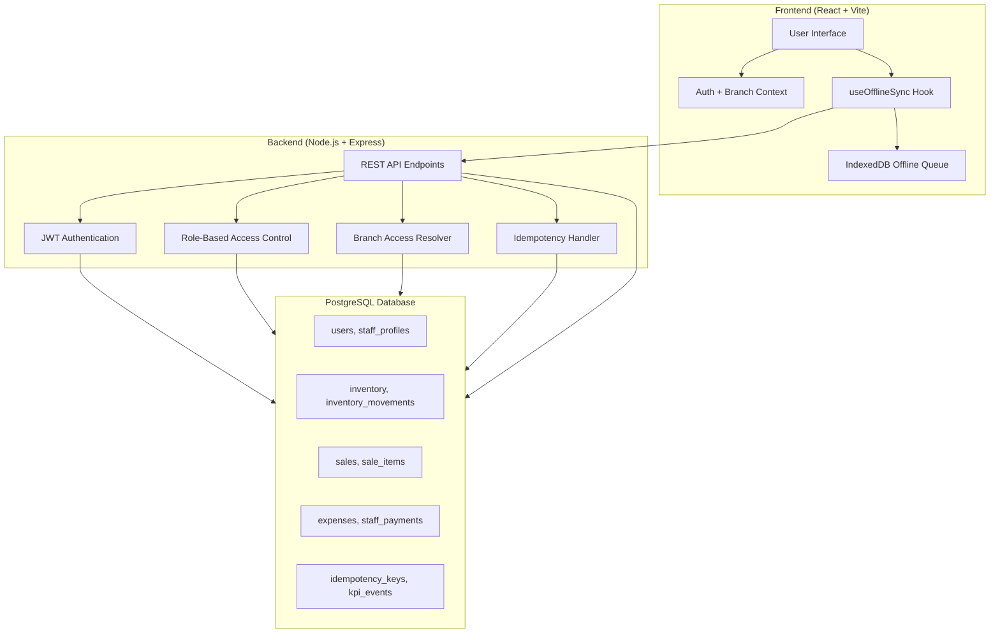
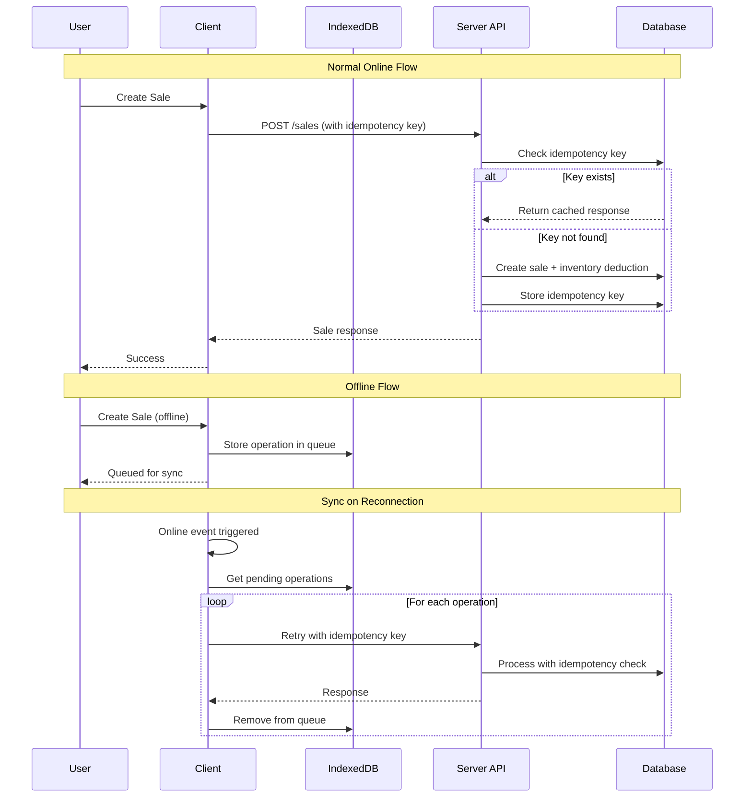
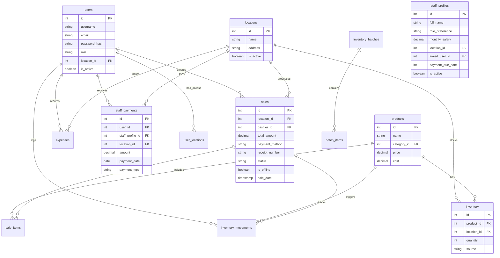
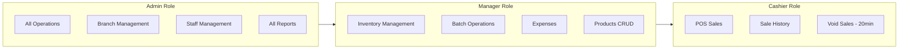
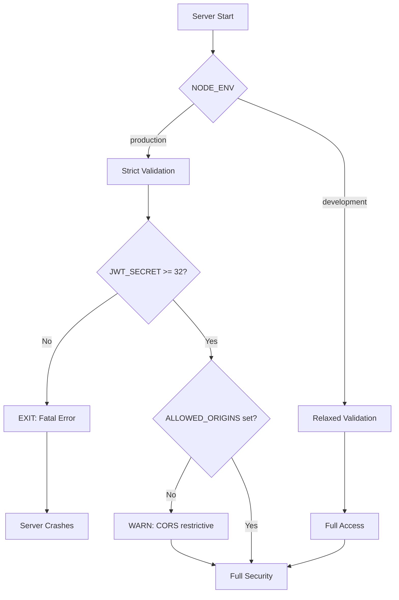

# Bakery Operations Web App

A production-ready, role-based bakery management platform for day-to-day operations across one or many branches.

## Features

- **Real-time inventory tracking** with oversell protection
- **POS sales** with offline support
- **Sale voiding** within 20-minute window with inventory restoration
- **Expenses and staff payments** management
- **Operational reports** with weekly/monthly exports
- **Branch-level controls** with role-based access
- **Offline queue/retry logic** with IndexedDB
- **Idempotent write handling** for data consistency
- **Alert rules and KPI telemetry**

---

## Architecture Overview



---

## Offline Sync Architecture



---

## Database Schema



---

## Quick Start

### Prerequisites
- Node.js 18+
- PostgreSQL 12+
- npm

### Installation

```bash
# Install dependencies
npm install
cd client && npm install && cd ..

# Set up environment
cp .env.example .env
# Edit .env with your database credentials

# Initialize database
npm run setup-db

# Run migrations
psql "$DATABASE_URL" -f database/migrations/001_ops_hardening.sql
psql "$DATABASE_URL" -f database/migrations/002_branch_access_and_kpi.sql
psql "$DATABASE_URL" -f database/migrations/005_sales_void_support.sql

# Start development server
npm run dev
```

### Access

- **Frontend**: http://localhost:3000
- **Backend API**: http://localhost:5000
- **Default login**: username `admin`, password `admin123`

---

## Environment Variables

| Variable | Required | Description |
|----------|----------|-------------|
| `PORT` | No | Server port (default: 5000) |
| `NODE_ENV` | Yes | `development` or `production` |
| `JWT_SECRET` | **Yes** | Min 32 characters |
| `DATABASE_URL` | **Yes** | PostgreSQL connection string |
| `ALLOWED_ORIGINS` | Prod | Comma-separated CORS origins |

---

## Role-Based Access



| Feature | Admin | Manager | Cashier |
|---------|-------|---------|---------|
| Dashboard | ✅ | ❌ | ❌ |
| All Branches | ✅ | ❌ | ❌ |
| Assigned Branch | ✅ | ✅ | ✅ |
| Inventory | ✅ | ✅ | ❌ |
| Sales | ✅ | ❌ | ✅ |
| Expenses | ✅ | ✅ | ❌ |
| Staff Payments | ✅ | ❌ | ❌ |
| Reports | ✅ | ❌ | ❌ |
| Products | ✅ | ✅ | ❌ |
| Sale Void | ✅ | ✅ | ✅ (20min) |

---

## Security

This application implements multiple layers of security to protect data and prevent common vulnerabilities.

### Authentication & Authorization

- **JWT-based authentication** with configurable token expiration
- **Role-based access control (RBAC)** with three roles: Admin, Manager, Cashier
- **Password hashing** using bcrypt with salt rounds of 12
- **Password validation** enforcing minimum 8 characters, letters, numbers, and special characters

### Rate Limiting

- **Authentication endpoints**: 10 requests/15min (production), 100 requests/min (development)
- **General API endpoints**: 100 requests/15min (production), 1000 requests/30s (development)
- **Strict endpoints**: 5 requests/hour (production), 50 requests/min (development)
- **Password reset**: 3 requests/hour (production), 20 requests/min (development)
- IPv6-aware key generation to prevent bypass attempts

### HTTP Security

- **Helmet.js** middleware for security headers:
  - X-Content-Type-Options: nosniff
  - X-Frame-Options: DENY
  - X-XSS-Protection
  - Strict-Transport-Security (HSTS)
  - Content-Security-Policy (CSP)

### CORS Configuration

- **Development**: All origins allowed (`origin: true`)
- **Production**: Strict origin whitelist via `ALLOWED_ORIGINS` environment variable
- Credentials support enabled

### Database Security

- **Parameterized queries** (using `$1, $2, ...` syntax) to prevent SQL injection
- **SSL/TLS support** with configurable certificate verification
- **Connection pooling** with configurable limits
- **Transaction support** for atomic operations

### Input Validation

- **express-validator** for request validation
- **Input sanitization** to prevent XSS
- Strict type checking on all endpoints

### Idempotency

- **X-Idempotency-Key** header support for write operations
- Prevents duplicate submissions during network retries
- Essential for offline queue operations

### Graceful Shutdown

- Proper connection draining on server stop
- Database pool cleanup
- In-flight request completion

### Environment Validation



---

## API Endpoints

### Authentication
- `POST /api/auth/login` - User login
- `POST /api/auth/register` - Create user (admin only)
- `GET /api/auth/me` - Current user
- `POST /api/auth/change-password` - Change password
- `POST /api/auth/refresh-token` - Refresh JWT

### Sales
- `GET /api/sales` - List sales
- `POST /api/sales` - Create sale (with offline support)
- `GET /api/sales/:id` - Sale details
- `POST /api/sales/:id/void` - Void sale (20-minute window)

### Inventory
- `GET /api/inventory` - List inventory
- `POST /api/inventory` - Create inventory record
- `PUT /api/inventory/:productId` - Update inventory
- `POST /api/inventory/batches` - Create batch (with offline support)

### Reports
- `GET /api/reports/daily` - Daily summary
- `GET /api/reports/weekly` - Weekly summary
- `GET /api/reports/weekly/export` - CSV export
- `GET /api/reports/monthly` - Monthly summary
- `GET /api/reports/branches/summary` - Multi-branch snapshot
- `GET /api/reports/kpis` - KPI metrics

---

## Offline Support

Operations that support offline queueing:

| Operation | Offline Support | Idempotency |
|-----------|----------------|-------------|
| Create Sale | ✅ | ✅ |
| Create Inventory Batch | ✅ | ✅ |
| Create Expense | ✅ | ✅ |
| Create Staff Payment | ✅ | ✅ |

The offline system features:
- **Exponential backoff** for retries
- **Conflict detection** and logging
- **Manual retry** from UI
- **Global offline indicator** with queue stats
- **Payload persistence** for conflict recovery

---

## Deployment

### Docker

```bash
# Build image
docker build -t bakery-ops-app .

# Run container
docker run -p 5000:5000 --env-file .env bakery-ops-app
```

### Docker Compose

```bash
docker-compose up -d
```

### Production Checklist

- [ ] Set strong `JWT_SECRET` (32+ characters)
- [ ] Configure `ALLOWED_ORIGINS` for CORS
- [ ] Set `NODE_ENV=production`
- [ ] Configure SSL/TLS
- [ ] Set up database backups
- [ ] Configure monitoring/logging
- [ ] Run all migrations

---

## Development

```bash
# Run in development mode
npm run dev

# Run tests
npm test

# Run linting
npm run lint

# Validate environment
npm run validate:env
```

---

## License

MIT
