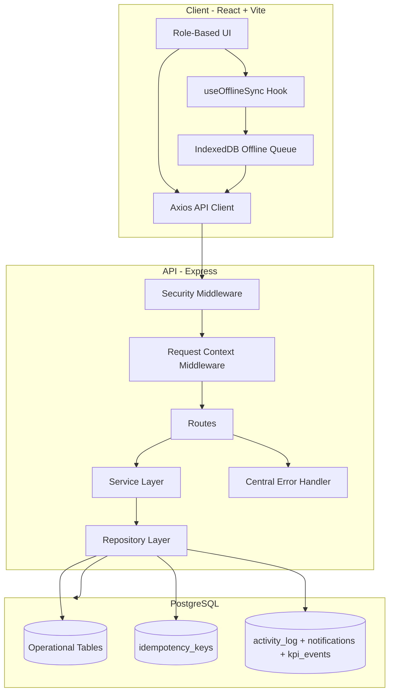
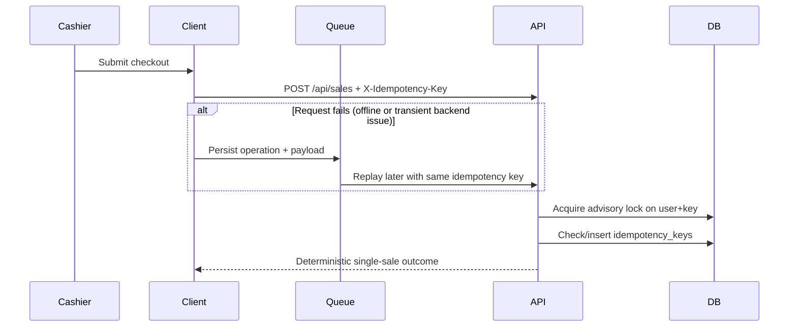

# Bakery Operations Platform

A production-oriented, role-based bakery management system with multi-branch operations, offline-safe sales replay, idempotent write protection, and hardened API/DB resilience.

## Table of Contents

- [Overview](#overview)
- [Architecture](#architecture)
- [Core Reliability Design](#core-reliability-design)
- [Security Controls](#security-controls)
- [Project Structure](#project-structure)
- [Environment Configuration](#environment-configuration)
- [Development Workflow](#development-workflow)
- [Testing and Quality Gates](#testing-and-quality-gates)
- [Production-like Local Run (Frontend + Backend)](#production-like-local-run-frontend--backend)
- [Deployment Strategy (No Feature Loss)](#deployment-strategy-no-feature-loss)
- [Deployment Checklist](#deployment-checklist)

## Overview

The platform is designed for real bakery operations where intermittent connectivity and high checkout concurrency are normal. The current architecture emphasizes:

- predictable sales processing under unstable networks,
- replay-safe offline synchronization,
- transaction-safe backend operations,
- standardized API error responses with request tracing.
- browser-level offline page boot support for refresh scenarios.

## Architecture

### High-Level System Diagram



### Backend Layering

- `server/routes/`: HTTP transport concerns (validation, request/response mapping).
- `server/services/`: business rules and workflow orchestration.
- `server/repositories/`: SQL and persistence concerns.
- `server/middleware/`: authentication, authorization, security, request context.
- `server/utils/errors.js`: normalized API errors in the format:

```json
{
  "error": "Human-readable error message",
  "code": "ERROR_CODE",
  "requestId": "req-timestamp"
}
```

## Core Reliability Design

This section documents the reliability hardening added specifically to prevent the previously observed offline-sync failure patterns.

### 1) Offline Replay Safety

- Sales requests use `X-Idempotency-Key` to prevent duplicate writes.
- In production builds, a service worker caches the app shell (`index.html` + static assets) so users can refresh and still open the app UI while offline.
- Offline operations are persisted in IndexedDB and replayed with the same idempotency identity.
- Queue flushes are guarded against overlap (`flushInProgress`) to prevent concurrent duplicate replay loops.
- Batches are capped (`MAX_BATCH_PER_FLUSH`) so one flush cycle does not overload a degraded backend.
- Adaptive request timeouts reduce false failures on slow connections.

### 2) Retry-Storm Prevention During Outages

- During queue replay, if an operation fails with server-unavailable characteristics (network failure / 5xx / 429), the queue pauses the remainder of the current batch.
- This reduces pressure on the API/DB during incidents and allows controlled retries on subsequent sync cycles.

### 3) Transaction and Connection Resilience

- Database transient failures are detected and classified (timeouts, terminated connections, connection transport errors).
- Transient DB failures are surfaced as `503` with a stable code (`DB_UNAVAILABLE`) for predictable client handling.
- Transaction rollback paths are guarded so broken sockets do not cascade into process-level instability.
- Broken clients are not reused in the pool (`release(true)` behavior).

### 4) Process Stability and Observability

- Request context middleware attaches a request ID for traceability.
- Centralized error handler standardizes API failure responses.
- Global process handlers avoid terminating the API process for recognized transient DB connectivity failures.

### 5) Idempotent Sales Flow



## Security Controls

- Helmet hardening enabled (with stricter policies in production).
- CORS policy controlled by `ALLOWED_ORIGINS`.
- API rate limiting for auth and general endpoints.
- JWT-based authentication with startup validation for secret strength.
- Parameterized SQL queries across persistence layer.
- Role-based authorization for protected routes.

## Project Structure

```text
client/          React + Vite frontend
server/          Express backend
  routes/        API route handlers
  middleware/    auth/security/validation/request context
  services/      business logic orchestration
  repositories/  persistence layer
  utils/         shared helpers and error handling
database/        PostgreSQL schema and migrations
scripts/         setup and utility scripts
```

## Environment Configuration

Required values (see `.env.example`):

```env
PORT=5000
NODE_ENV=production
JWT_SECRET=<min-32-chars>
DATABASE_URL=<postgresql-connection-string>
ALLOWED_ORIGINS=https://yourdomain.com
```

## Development Workflow

```bash
npm install
cd client && npm install && cd ..
npm run setup-db
npm run dev
```

Useful commands:

```bash
npm run server      # backend only
npm run client      # frontend only
npm run build       # production client build
npm start           # production server start
```

## Testing and Quality Gates

```bash
npm test
npm run lint
npm run build
```

## Production-like Local Run (Frontend + Backend)

Use this flow when validating offline-refresh behavior and backend APIs together.

1) Terminal A: run backend API

```bash
cd /workspace/bakery-ops-app
npm run server
```

2) Terminal B: build and preview frontend

```bash
cd /workspace/bakery-ops-app/client
npm run build
npm run preview
```

3) Open the preview URL (usually `http://localhost:4173`).

4) Make sure frontend can call backend:
- If needed, set `VITE_API_URL=http://localhost:5000/api` in `client/.env` for preview/deploy environments.
- If your platform uses different domains, ensure `ALLOWED_ORIGINS` on backend includes the frontend origin.

Notes:
- `npm run preview` exists in `client/package.json`, not root `package.json`.
- Offline-refresh testing should be done with preview/deployed build, not Vite dev mode.

## Deployment Strategy (No Feature Loss)

To avoid losing offline and sync behavior when frontend/backend are deployed separately:

- Deploy backend API and frontend app as separate artifacts/environments.
- Keep API contract stable (`Authorization`, `X-Location-Id`, `X-Idempotency-Key`, error format).
- Keep service worker and offline queue enabled in production frontend build.
- Ensure frontend base API URL targets the deployed backend (`VITE_API_URL`).
- Ensure backend CORS (`ALLOWED_ORIGINS`) allows deployed frontend origins.
- Validate key acceptance flows after each release:
  - normal online sale,
  - offline sale queue,
  - reconnect + sync replay,
  - offline refresh on already-visited route.

## Deployment Checklist

- Set `NODE_ENV=production`
- Set strong `JWT_SECRET` (32+ chars)
- Set `DATABASE_URL` with SSL policy
- Configure `ALLOWED_ORIGINS`
- Apply database migrations before startup
- Verify health probes: `/api/health`, `/api/ready`, `/api/live`
