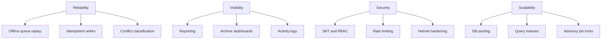
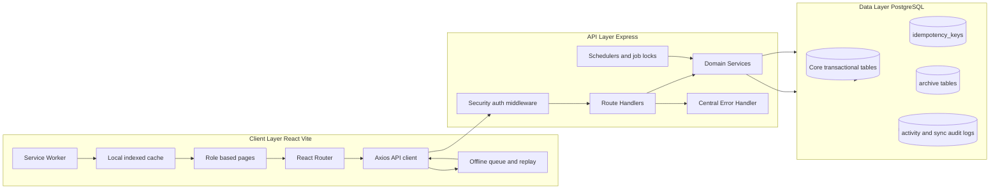
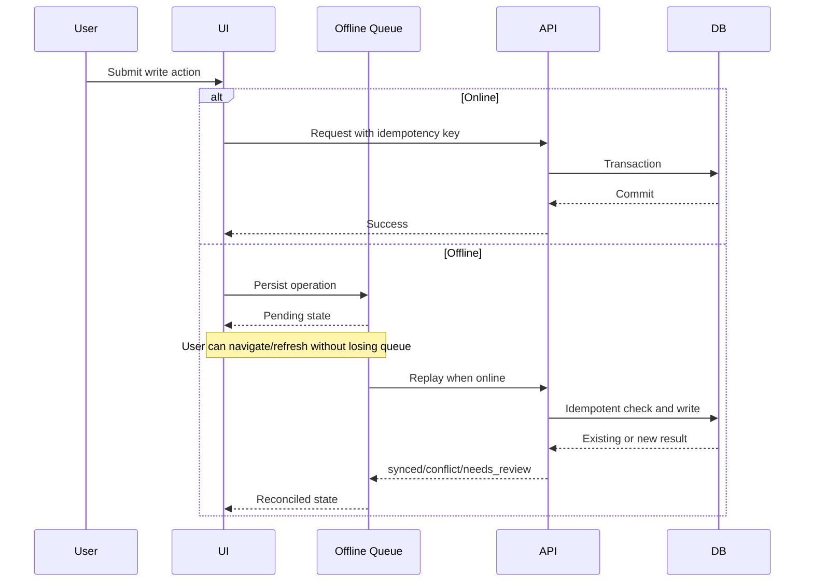
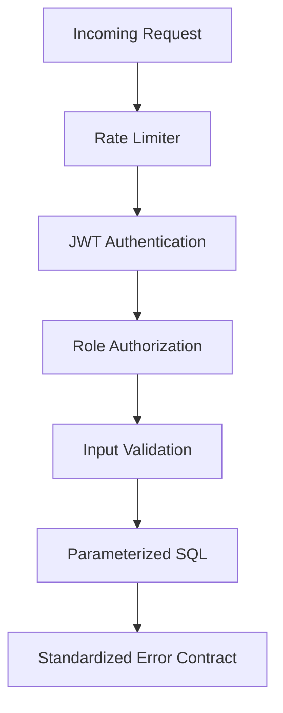
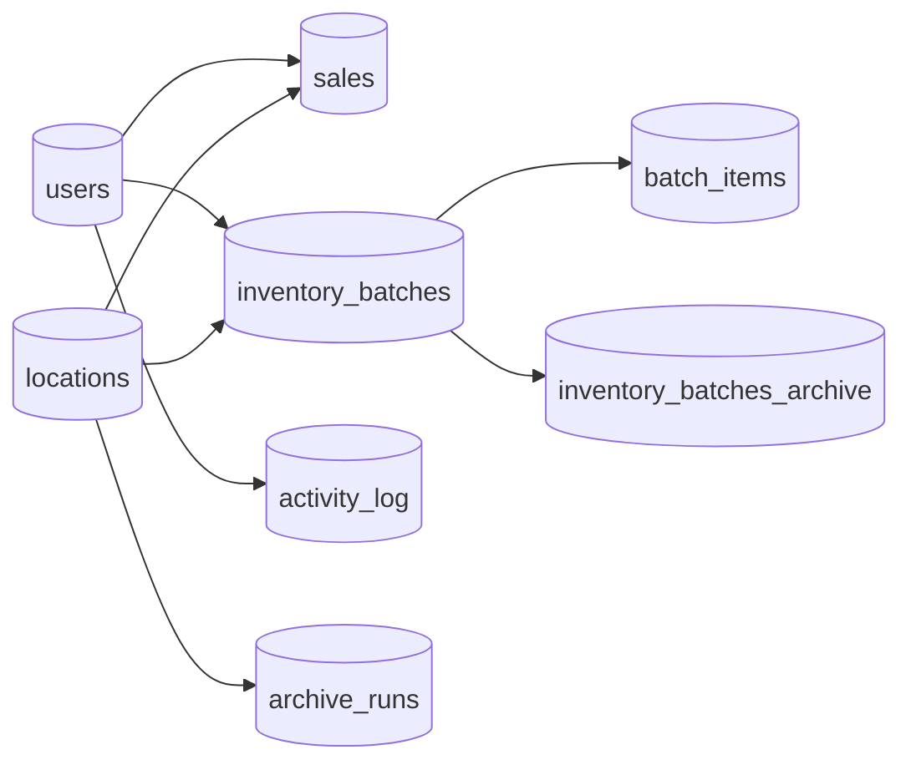

# Bakery Operations Platform

A production-oriented, offline-capable bakery management system for multi-branch operations, designed for reliable daily execution under unstable connectivity and strict operational accountability.

**Lead Developer:** Asotu3

---

## Table of Contents

- [Executive Summary](#executive-summary)
- [Platform Outcomes](#platform-outcomes)
- [System Architecture](#system-architecture)
- [Offline Sync and Offline Refresh Design](#offline-sync-and-offline-refresh-design)
- [Security and Compliance Controls](#security-and-compliance-controls)
- [Session and Token Lifecycle](#session-and-token-lifecycle)
- [Staff Payments Behavior](#staff-payments-behavior)
- [Database Architecture](#database-architecture)
- [API Design and Contracts](#api-design-and-contracts)
- [Performance and Scalability](#performance-and-scalability)
- [Timezone Strategy](#timezone-strategy)
- [Repository Structure](#repository-structure)
- [Developer Workflow](#developer-workflow)
- [Testing Strategy](#testing-strategy)
- [Operations and Deployment](#operations-and-deployment)
- [Documentation Map](#documentation-map)
- [Production Readiness Checklist](#production-readiness-checklist)

---

## Executive Summary

The Bakery Operations Platform combines:

- **Role-based workflows** for admin, manager, and cashier responsibilities.
- **Offline-safe transaction handling** with idempotent replay semantics.
- **Inventory and batch lifecycle tracking** including archive workflows.
- **Auditable operational history** through logs, sync audit records, and traceable error contracts.

The system is intentionally engineered so day-to-day branch activity can continue through temporary internet or backend instability without corrupting sales data.

---

## Platform Outcomes


```mermaid
flowchart TB
  A[Reliability] --> A1[Offline queue replay]
  A --> A2[Idempotent writes]
  A --> A3[Conflict classification]
  B[Visibility] --> B1[Reporting]
  B --> B2[Archive dashboards]
  B --> B3[Activity logs]
  C[Security] --> C1[JWT and RBAC]
  C --> C2[Rate limiting]
  C --> C3[Helmet hardening]
  D[Scalability] --> D1[DB pooling]
  D --> D2[Query indexes]
  D --> D3[Advisory job locks]
```

### Core Business Capabilities

- Sales, expenses, payments, inventory management, and pre-order lifecycle orchestration.
- Grouped product variants across admin, manager, and cashier workflows (group card -> variant selection).
- Dynamic expense categories with audit-friendly expense codes and creator attribution.
- Branch-aware access via role and location constraints.
- Scheduled archive jobs.
- Addis Ababa timezone-consistent UI presentation.

---

## System Architecture


```mermaid
flowchart LR
  subgraph Frontend[Client Layer React Vite]
    UI[Role based pages]
    Router[React Router]
    APIClient[Axios API client]
    OfflineQ[Offline queue and replay]
    SW[Service Worker]
    Cache[Local indexed cache]
  end

  subgraph Backend[API Layer Express]
    MW[Security auth middleware]
    Routes[Route Handlers]
    Services[Domain Services]
    Errors[Central Error Handler]
    Jobs[Schedulers and job locks]
  end

  subgraph Data[Data Layer PostgreSQL]
    Core[(Core transactional tables)]
    Idem[(idempotency_keys)]
    Archive[(archive tables)]
    Audit[(activity and sync audit logs)]
  end

  UI --> Router --> APIClient --> MW --> Routes --> Services --> Data
  APIClient --> OfflineQ --> APIClient
  SW --> Cache --> UI
  Routes --> Errors
  Jobs --> Services --> Data
  Data --> Core
  Data --> Idem
  Data --> Archive
  Data --> Audit
```

### Architecture Principles

1. Keep the API deterministic under retries.
2. Treat network volatility as a normal condition.
3. Preserve auditable event history for operations and finance.
4. Keep operational safety defaults in production.

---

## Offline Sync and Offline Refresh Design


```mermaid
sequenceDiagram
  participant User
  participant UI
  participant Queue as Offline Queue
  participant API
  participant DB

  User->>UI: Submit write action
  alt Online
    UI->>API: Request with idempotency key
    API->>DB: Transaction
    DB-->>API: Commit
    API-->>UI: Success
  else Offline
    UI->>Queue: Persist operation
    Queue-->>UI: Pending state
    Note over UI,Queue: User can navigate/refresh without losing queue
    Queue->>API: Replay when online
    API->>DB: Idempotent check and write
    DB-->>API: Existing or new result
    API-->>Queue: synced/conflict/needs_review
    Queue-->>UI: Reconciled state
  end
```

### Reliability Mechanisms

- Cashier sales now block add/increase actions when stock is exhausted and still show variants as out-of-stock in the selector for better operator clarity.
- Idempotent write headers for retry-safe replay.
- Replay status model (`synced`, `failed`, `conflict`, `needs_review`, `ignored`, `resolved`).
- API error envelope consistency (`error`, `code`, `requestId`) for client classification.
- Cache fallback in key manager/cashier pages for continuity.
- Single-flight offline queue flush locking to prevent overlapping replay runs.
- Service-worker shell caching that discovers and caches current hashed build assets from `index.html`.

### Important Development Note

In development mode, service workers are intentionally unregistered to prevent stale production workers from interfering with Vite dev behavior. Validate offline refresh using production build/preview behavior (`npm run build` + `npm run preview` in `client/`).

---


## Pre-Order Workflow

Three-role order lifecycle:

- Cashier creates pre-orders with mixed items: existing product variants and ad-hoc custom items.
- Manager works from the preparation queue, updates progress, and marks orders ready.
- Admin oversees all orders, verifies payment completion, and marks pickup completion.

Technical behavior:

- API endpoints: `GET /api/orders`, `POST /api/orders`, `PATCH /api/orders/:id`.
- Order items are persisted in `order_items` and linked to `customer_orders`.
- Inventory is decremented once when an order transitions to ready/prepared for product-linked items.
- Orders can be edited/deleted only within a 20-minute edit/delete safety window after creation.
- Cashier pre-order creation supports offline queue replay using idempotency keys.
- Cashier pre-order item selection auto-fills product prices, shows live total/paid/balance values, and supports product dropdown fallback from offline cached products.
- Admin and manager order oversight now include dedicated customer-note viewing actions with larger note editing/readability surfaces.
- Order performance is surfaced on admin dashboard period views (daily/weekly/monthly) from picked-up orders for revenue transparency and is included in revenue/profit rollups.
- Offline refresh session continuity preserves authenticated state when `/auth/me` cannot be reached due to offline network conditions.
- Inventory lists now hide archived products and admin inventory identifiers are formatted for readability (e.g. `INV-000123`).
- Expense visibility is role-aware: managers only see expenses they created, while admins retain full branch visibility.
- Archive lifecycle now includes pre-order history (`customer_orders` and `order_items`) in 6-month archival and export datasets.

## Security and Compliance Controls


```mermaid
flowchart TB
  Request[Incoming Request]
  Auth[JWT Authentication]
  RBAC[Role Authorization]
  Rate[Rate Limiter]
  Validate[Input Validation]
  SQL[Parameterized SQL]
  Errors[Standardized Error Contract]

  Request --> Rate --> Auth --> RBAC --> Validate --> SQL --> Errors
```

### Security Controls in Place

- JWT secret length enforcement and issuer validation.
- Account lockout/backoff after repeated failed logins.
- Refresh-token rotation endpoint for stronger session lifecycle handling.
- Role-based access control on privileged routes.
- Rate limiting tiers (auth/general/strict).
- Helmet security headers and production-oriented CORS controls.
- Parameterized SQL queries to reduce injection risk.
- Password complexity validation.
- Request-scoped IDs for incident traceability.

### Security Roadmap Recommendations

- Extend structured security event logging for SIEM-friendly ingestion.
- Add automated refresh-token cleanup/retention jobs and suspicious-login alerting.
- Introduce tenant-aware session revocation controls for emergency lockout scenarios.

---


## Session and Token Lifecycle

- Access tokens are used on every API call and can expire during normal use.
- The client now keeps session credentials per browser tab using `sessionStorage` so role context does not leak across multiple open accounts.
- On `401` responses from non-auth endpoints, the client performs a single-flight refresh-token rotation (`/api/auth/refresh-token/rotate`) and retries the original request.
- If refresh fails (expired/revoked token), the app clears session state and redirects to login with `session_expired`.
- Logout revokes the current refresh token server-side and clears client session keys.

## Staff Payments Behavior

Staff payment records support two payout modes:

- `Pay Now` (`payout_mode=pay_now`): immediate payroll entry for the selected staff and payment date.
- `Pay to Month` (`payout_mode=pay_to_month`): payroll entry assigned to a target month via `payroll_month`, used for monthly settlement planning/reporting.

Additional rules:

- Frequency (`daily`, `weekly`, `monthly`) is saved per payment and used in payment summaries.
- Edit/delete is allowed only within a 20-minute safety window from record creation.
- Offline creation is queue-safe with idempotency keys to avoid duplicate replay writes.
- Staff payment creation now supports a worked-days recommendation flow (days since last payment x daily salary rate) to assist prorated payouts.

## Database Architecture


```mermaid
flowchart LR
  USERS[(users)] --> SALES[(sales)]
  USERS --> INVENTORY_BATCHES[(inventory_batches)]
  USERS --> ACTIVITY_LOG[(activity_log)]
  LOCATIONS[(locations)] --> SALES
  LOCATIONS --> INVENTORY_BATCHES
  INVENTORY_BATCHES --> BATCH_ITEMS[(batch_items)]
  INVENTORY_BATCHES --> INVENTORY_BATCHES_ARCHIVE[(inventory_batches_archive)]
  LOCATIONS --> ARCHIVE_RUNS[(archive_runs)]
```

### Data Strategy

- Core transactional tables for operational workload.
- Archive tables for historical cold-storage movement.
- Sync audit and activity logs for diagnostics and accountability.
- Performance indexes added for high-frequency filters/sorts (inventory batches, sales, notifications, archive runs).

### Migration and Setup Safety

- Transactional migration execution.
- Advisory lock during setup/migrations to avoid concurrent runners.
- Optional dev-only seed path, gated by environment variables.
- Startup auth schema guard ensures lockout columns and refresh-token table exist in partially migrated environments.

---

## API Design and Contracts

### Global Error Contract

```json
{
  "error": "Human-readable error message",
  "code": "ERROR_CODE",
  "requestId": "req-..."
}
```

### Offline Write Header Contract

```http
Authorization: Bearer <token>
X-Location-Id: <branch-id>
X-Idempotency-Key: <stable-operation-id>
X-Queued-Request: true
X-Queued-Created-At: <iso-timestamp>
X-Retry-Count: <retry-number>
```

### High-Value API Domains

- `/api/auth` for authentication and account operations.
- `/api/sales` for checkout and revenue records.
- `/api/inventory` for stock and batch operations.
- `/api/archive` for retention policy and archive execution.
- Manual Danger-Zone archive runs now force a `cutoffAt=now` execution for the selected branch, so admins can archive currently available history immediately (while keeping scheduled retention behavior unchanged).
- `/api/sync` for offline audit status and reconciliation metadata.

---

## Performance and Scalability


```mermaid
flowchart LR
  A[Client Request] --> B[Express Route]
  B --> C[DB pool and timeouts]
  C --> D[Indexed Query]
  D --> E[Response]
  B --> F[Scheduler Path]
  F --> G[Advisory Job Lock]
  G --> C
```

### Implemented Optimizations

- Connection pool tuning and timeout controls.
- Slow query/transaction warning logs.
- List endpoint limit clamping and input validation.
- New DB indexes for common read paths.
- Advisory locks for scheduled jobs in multi-instance environments.

---

## Timezone Strategy

- Backend stores and returns timestamps in server/UTC semantics.
- Frontend display is standardized to `Africa/Addis_Ababa` for locale rendering paths.
- This ensures users across pages see consistent business-time display.

---

## Repository Structure

```text
client/                    React + Vite frontend
server/                    Express API and backend logic
  middleware/              auth, security, request context
  routes/                  API endpoints
  services/                business workflows and schedulers
  utils/                   error helpers, location helpers, etc.
database/
  schema.sql               base schema
  migrations/              incremental SQL migrations
scripts/                   setup and utility scripts
docs/                      deep architecture and contract docs
Main docs/                 primary onboarding and operational guides
```

---

## Developer Workflow

1. Configure `.env` from `.env.example`.
2. Run database setup (`npm run setup-db`).
3. Start local environment (`npm run dev`).
4. Validate changes (`npm test`, `npm run lint`, `npm run build`).
5. Follow offline contract and error contract rules for new endpoints.

---

## Testing Strategy

- Unit tests for middleware and utility critical paths.
- Offline queue behavior tests for replay and failure semantics.
- Error handler tests for envelope consistency.
- Build/lint checks for integration-level confidence.

Recommended expansion:

- Add route-level integration tests for auth/inventory/archive.
- Add API contract snapshot tests for error and pagination behavior.
- Add scheduled-job simulation tests for multi-instance scenarios.

---

## Operations and Deployment

See dedicated deployment guidance in:

- `Main docs/deployment-and-infrastructure.md`
- `docs/architecture-and-ops-playbook.md`

---

## Documentation Map

### Primary docs

- `README.md` (this file)
- `Main docs/README.md`
- `Main docs/developer-workflow-and-guardrails.md`
- `Main docs/deployment-and-infrastructure.md`
- `Main docs/offline-refresh-sync-protection.md`

### Technical references

- `docs/offline-contract.md`
- `docs/architecture-and-ops-playbook.md`

---

## Production Readiness Checklist

- [ ] `NODE_ENV=production`
- [ ] strong `JWT_SECRET` (32+ chars)
- [ ] `DATABASE_URL` configured with SSL
- [ ] `ALLOWED_ORIGINS` configured
- [ ] migrations applied successfully
- [ ] health/readiness probes validated
- [ ] offline contract verified in client replay flows
- [ ] build/test/lint green in CI
- [ ] scheduler locks validated in multi-instance deployment

---

For implementation details and contributor guardrails, continue in `Main docs/README.md`.

## Roles and Permissions

- **Admin**: full access to business operations, account/staff lifecycle, reports, sync monitoring, and credential management.
- **Ground Manager**: inventory and batch workflows with time-window safeguards for edits/void actions.
- **Cashier**: sales execution and cashier sales history with void-window safeguards.

Detailed reference: `Main docs/roles-and-permissions.md`.
